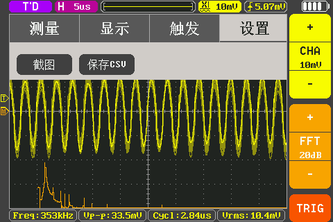
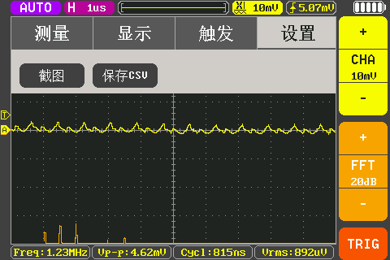

# WALL-E Robot — ESP32-S3 无线图传控制系统

<p align="center">
  
</p>

<p align="center">
  
  
  
  
</p>

> 深度复刻皮克斯 WALL-E 机器人，从 3D 打印到自研 PCB 再到 ESP-IDF 固件，全栈闭环。
>
> 本科毕业设计项目 —— 基于 ESP32-S3 的移动机器人无线图传系统设计与实现

---

## 目录

- [概述](#概述)
- [实物展示](#实物展示)
- [功能特性](#功能特性)
- [硬件架构](#硬件架构)
- [引脚映射](#引脚映射)
- [快速上手](#快速上手)
- [固件架构](#固件架构)
- [Web 控制面板](#web-控制面板)
- [通信协议](#通信协议)
- [性能测试](#性能测试)
- [硬件设计要点](#硬件设计要点)
- [项目结构](#项目结构)
- [致谢](#致谢)
- [许可证](#许可证)

---

## 概述

本项目全栈自研一台电影级别的 WALL-E 复刻机器人，集无线图传、远程控制、自主行为于一体。

**机械**：基于 [Chillibasket/walle-replica](https://github.com/chillibasket/walle-replica) 开源外壳，经 3D 打印、打磨、组装与喷漆涂装。

**硬件**：自研 12V 三路隔离电源分配板 + ESP32-S3 主控 PCB（窄铜桥接地解决电机地弹干扰）。

**固件**：基于 ESP-IDF 原生框架，FreeRTOS 多任务调度，组件化架构。

**通信**：WiFi STA 模式，WebSocket JSON 全双工协议（单向延迟 < 15ms），MJPEG 实时图传（24 FPS）。

---

## 实物展示

### 3D 打印表面处理

<p align="center">
  
  
</p>

### 主控电路板布局布线

<p align="center">
  
</p>

> 原理图：[02-Hardware/Main_Control_Board/SCH_WALL-E_MB_000_SCH_2026-06-01.pdf](./02-Hardware/Main_Control_Board/SCH_WALL-E_MB_000_SCH_2026-06-01.pdf)

---

## 功能特性

- **无线图传** — OV2640 摄像头 640×480 MJPEG 硬件编码，双缓冲推流，实测 24 FPS
- **全向运动** — 2 路直流电机（TB6612 驱动，LEDC 硬件渐变）+ 7 路舵机关节（PCA9685 驱动，平滑缓动插值）
- **Web 控制面板** — 零安装，手机/PC 浏览器即可操控，支持 Gamepad API 游戏手柄
- **音频交互** — DFPlayer Mini 播放电影原声音效（35+ 音效文件）
- **自主行为** — 8 套预设动画 + 7 种加权随机微表情 + 能量驱动行为决策
- **CLI 调试** — UART 串口控制台提供舵机/电机/音频/NVS 调试命令
- **电池管理** — ADC 电压监测 + 滑动平均滤波 + 低电量加速衰减
- **安全保护** — 电机 800ms 心跳超时自动刹车

---

## 硬件架构

```
                               ┌──────────────────┐
12V LiPo ──► 电源分配板 ──┬──► │ 驱动板 (电机/舵机)│
 (3S)      (3路隔离输出)    │    └──────────────────┘
                           │
                     ┌─────▼──────────────────────────┐
                     │      ESP32-S3 主控板             │
                     │  ┌──────────────────────────┐  │
                     │  │ ESP32-S3-WROOM-1 (N16R8) │  │
                     │  │ 16MB Flash / 8MB PSRAM   │  │
                     │  └──────┬───────┬───────────┘  │
                     │    I2C  │  DVP  │  UART         │
                     │  ┌──────┘       ▼              │
                     │  │    ┌──────────────────┐     │
                     │  │    │ OV2640 摄像头     │     │
                     │  │    │ 640×480 JPEG     │     │
                     │  │    └──────────────────┘     │
                     │  │                             │
                     │  ▼                             │
                     │  ┌──────────────────┐          │
                     │  │ PCA9685 舵机驱动 │──► 7舵机 │
                     │  ├──────────────────┤          │
                     │  │ SSD1306 OLED     │ 128×64   │
                     │  ├──────────────────┤          │
                     │  │ DFPlayer Mini    │──► 喇叭  │
                     │  └──────────────────┘          │
                     └────────────────────────────────┘
```

### 电源分配板
- 12V 输入（3S LiPo），3 路独立输出（PMOS 主开关）
- 保护：TVS + 防反接肖特基 + PTC 自恢复保险 + 两级电容滤波

### 主控板电源树
```
12V ──► TPS54308 (12V→5V, 3A) ──► TLV62569 (5V→3.3V, 2A)
                                      ├── ME6211 (3.3V→2.8V, OV2640 AVDD)
                                      └── ME6211 (3.3V→1.2V, OV2640 DVDD)
```

---

## 引脚映射

| 外设 | 接口 | 引脚 | 备注 |
|------|------|------|------|
| **左电机** | LEDC PWM | GPIO38 | 4kHz, 13-bit |
| | DIR1/2 | GPIO39, GPIO40 | |
| **右电机** | LEDC PWM | GPIO2 | 4kHz, 13-bit |
| | DIR1/2 | GPIO41, GPIO42 | |
| **I2C 总线** | SDA/SCL | GPIO4, GPIO5 | 400kHz, 2.2kΩ 上拉 |
| **PCA9685** | I2C addr | 0x40 | 7 路舵机 |
| **SSD1306 OLED** | I2C addr | 0x3C | 128×64 |
| **DFPlayer Mini** | UART2 TX/RX | GPIO6, GPIO7 | 9600 baud |
| **OV2640 摄像头** | DVP 8-bit | GPIO8~18 | 12 引脚并行 |
| | SCCB (I²C-like) | GPIO47, GPIO48 | 配置总线 |
| **电池 ADC** | ADC1_CH0 | GPIO1 | 2.5dB 衰减, 12-bit |
| **UART0 控制台** | TX/RX | GPIO43, GPIO44 | 通过 CH340K |

---

## 快速上手

### 前置依赖

- [ESP-IDF v5.5](https://docs.espressif.com/projects/esp-idf/en/v5.5/esp32s3/get-started/) 或更高版本
- USB 转 UART 驱动（CH340K）
- Python 3（ESP-IDF 安装时自带）

### 构建

```bash
cd 03-Software/Walle26
idf.py set-target esp32s3
idf.py build
```

### 烧录

```bash
idf.py -p /dev/ttyUSB0 flash   # Linux/macOS
idf.py -p COM3 flash            # Windows
```

### 配置 WiFi

编辑 `sdkconfig.defaults` 中的 WiFi SSID 和密码，或通过 menuconfig 配置：

```bash
idf.py menuconfig
# 路径: WiFi Configuration > WiFi SSID / WiFi Password
```

### 连接

1. 给机器人上电（12V 3S LiPo）
2. 等待 ESP32 连接 WiFi（串口日志查看 IP 地址，`ESP_LOGI("WIFI", "获取到 IP: ...")`）
3. 浏览器访问 `http://<ESP32-IP>` 打开控制面板
4. 视频流地址：`http://<ESP32-IP>:8081/stream`
5. 串口监视器：`idf.py -p <PORT> monitor`

---

## 固件架构

### 组件化分层

```
main.c (初始化 + 任务创建)
│
├── Servo/              PCA9685 I2C 驱动 + 20ms 缓动插值任务
├── DC_Motor/            LEDC 硬件异步渐变 + 800ms 心跳安全刹车
├── wifi/                WiFi STA + HTTP + WebSocket + MJPEG 推流
│   ├── camera_app.c     OV2640 初始化与双缓冲帧管理
│   ├── ws_handler        JSON 指令解析与分发
│   └── index.html        Web 控制面板（内嵌固件）
├── animation_engine/     8 套关键帧动画 + 7 种微表情生成器
├── energy_manager/       0~100 能量值驱动行为决策状态机
├── battery/              ADC 采样 + 8 阶滑窗滤波 + LiPo 查表
├── DFPlayerMini/         UART 串口音频播放
├── command/              CLI 调试命令（舵机/电机/音频/NVS/动画）
└── display/              SSD1306 电池电量显示
```

### 任务调度 (FreeRTOS)

| 核心 | 任务 | 优先级 | 周期 |
|------|------|--------|------|
| Core 0 | `wifi_app_task` | — | 事件驱动 |
| Core 1 | `motor_ctrl_task` | 15 | 队列驱动 + 心跳 |
| Core 1 | `servo_fade_task` | — | 20ms |
| Core 1 | `servo_logic_task` | — | 队列驱动 |
| Core 1 | `anim_engine_task` | 8 | 队列驱动 |
| Core 1 | `energy_mgr_task` | 6 | 1s |
| Core 1 | `battery_task` | — | 1s |

### 控制流示例：WebSocket → 舵机

```
浏览器 ── WebSocket JSON ──► ws_handler
                                  │
                            energy_manager ← ENGAGED
                                  │
                            servo_cmd_queue (覆盖写)
                                  │
                            servo_control_task
                                  │
                            walle_joint_move()
                                  │
                            servo_fade_task (20ms 缓动插值)
                                  │
                            PCA9685_set_angle() ──► 舵机
```

### 能量管理行为决策

无人操控时，能量以 0.08/s 衰减（低电量翻倍），自动选择区间对应的动画：

```
 能量 80~100 ── 微表情（7 种加权随机）
 能量 40~80  ── 好奇/探索（预设动画）
 能量 10~40  ── 低落/害羞
 能量 0      ── 假寐姿态
```

WebSocket 有活动时立即切回 `ENGAGED`（能量 = 100），恢复远程控制。

---

## Web 控制面板

内置于固件的 HTML5 控制面板，无需安装任何 App，浏览器访问 `http://<ESP32-IP>` 即可使用。

### 功能

| 功能 | 说明 |
|------|------|
| **实时状态** | HTTP `/status` 轮询显示电量、能量、表情状态 |
| **关节可视化** | 7 路关节进度条实时显示，WebSocket 50ms 高频推送 |
| **链路状态** | 连接/断开/重连指示器 |
| **游戏手柄** | Browser Gamepad API，摇杆控履带，扳机控手臂 |
| **MJPEG 图传** | 640×480 实时视频，按钮启停 |
| **调试面板** | 实时显示收发 JSON 数据帧 |

### 控制台布局示意

```
┌──────────────────────────────────────────────┐
│  ⬡ WALL-E                              78% 😊 │
├──────────────────┬───────────────────────────┤
│  系统             │  关节                     │
│  IP: 192.168.x.x │  头部 ████████░░ 68       │
│  链路 ● ONLINE   │  脖顶 ██████░░░░ 52       │
│  手柄 ● READY    │  左眼 ██░░░░░░░░ 20       │
│                   │  右眼 ████████░░ 70       │
│  动力             │  左臂 ░░░░░░░░░░  0       │
│  左履带 ████ 45   │  右臂 ░░░░░░░░░░  0       │
│  右履带 ███ -30   │                           │
├──────────────────┴───────────────────────────┤
│  📷 启动图传                                   │
├──────────────────────────────────────────────┤
│  {"L":45,"R":-30,"S":[68,52,48,20,70,0,0]}   │
└──────────────────────────────────────────────┘
```

---

## 通信协议

### WebSocket (ws://`<ESP-IP>`/ws)

JSON 格式双向通信：

```json
{
  "L": 50,           // 左履带速度 (-100 ~ 100)
  "R": -30,          // 右履带速度 (-100 ~ 100)
  "S": [50,50,50,50,50,30,30],  // 7 关节角度 (0~100)
  "D": 100           // 舵机动作持续时间 (ms)
}
```

服务端回显收到的帧，用于客户端计算 RTT。

### MJPEG 流 (http://`<ESP-IP>`:8081/stream)

- 协议：`multipart/x-mixed-replace`
- 分辨率：640×480 (VGA)
- 编码：硬件 JPEG
- 帧率：~24 FPS
- 双缓冲：`fb_count = 2`

### REST API

| 端点 | 方法 | 返回 |
|------|------|------|
| `/status` | GET | JSON（电量、能量、WiFi 信号等） |
| `/` | GET | Web 控制面板 HTML |

---

## 性能测试

### WebSocket 延迟（端到端单向）

| 场景 | 单向延迟 |
|------|----------|
| 同房间 3m 无遮挡 | **12.46 ms** |
| 隔一堵混凝土墙 5m | **13.22 ms** |
| 隔两堵墙 10m | **48.14 ms** |

所有场景 ≤ 50ms，满足设计指标。

### MJPEG 帧率

| 采样帧数 | 帧率 |
|----------|------|
| 100 帧 | 23.6 FPS |
| 500 帧 | **24.2 FPS** |

超设计目标 15 FPS 约 57%。

### 电源纹波

| 转换器 | 开关频率 | 纹波 |
|--------|----------|------|
| TPS54308 (12V→5V) | 358 kHz | 6.38 mVp-p |
| TLV62569 (5V→3.3V) | 1.27 MHz | 9.70 mVp-p |

<p align="center">
  
  
</p>

### 舵机精度

控制误差 ±0.5°~1°（受舵机死区限制），优于设计指标 ±2°。

---

## 硬件设计要点

> 本项目的核心难点：电机/舵机感性负载的高频地弹噪声对主控芯片的传导干扰。

### 窄铜桥接地（Split-Ground-Plane Bridge）

PCB 分为洁净区（MCU 数字地）和污染区（电机电源地），中间以 **4~5mm 宽顶底双层覆铜桥** 作为两地唯一连接点：

- **信号回流**：所有跨区信号线紧贴铜桥上方走线，回流紧贴桥底返回，环路面积 ≈ 0
- **噪声扼制**：高频噪声冲击窄桥时，窄覆铜的寄生电感形成扼流效应，将噪声逼回电源粗线路径

辅助措施：PWM 线串联 100Ω 抑制过冲，I²C 2.2kΩ 上拉增强抗扰，XCLK/PCLK 串联 22Ω 保证图像完整性。

---

## 项目结构

```
WallE_Graduation/
├── 01-Spec/                 设计需求、引脚分配、命名规范
├── 02-Hardware/             原理图 (PDF)
│   ├── Power_Distribution_Board/
│   └── Main_Control_Board/
├── 03-Software/Walle26/     ESP-IDF 固件项目
│   ├── main/main.c          主入口
│   ├── Components/          组件化驱动
│   │   ├── Servo/           舵机 (PCA9685 + 平滑动画)
│   │   ├── DC_Motor/        直流电机 (LEDC 渐变)
│   │   ├── DFPlayerMini/    音频
│   │   ├── wifi/            WiFi + WebSocket + MJPEG + Web UI
│   │   ├── animation_engine/ 动画引擎
│   │   ├── energy_manager/  能量管理
│   │   ├── battery/         电池监测
│   │   ├── command/         CLI 调试命令
│   │   └── display/         OLED 显示
│   └── managed_components/  依赖组件
├── 04-Mechanical/           3D 打印 STL (~70 文件)
├── 05-Assets/               照片、视频、音效参考
└── 06-Thesis/               毕业论文 + 流程图 + 参考文献
```

---

## 致谢

### 机械原型
- [Chillibasket/walle-replica](https://github.com/chillibasket/walle-replica) — WALL-E 外壳开源设计

### 技术参考
- Espressif ESP-IDF 物联网开发框架
- TI SPRAAS1B — *Hardware Design Guidelines for TMS320F28xx*
- [Split Ground Planes — The Most Persuasive Argument Yet](https://hott.shielddigitaldesign.com/techtips/split-gnd-plane.html)

### 开源组件
- [nixy4/u8g2](https://components.espressif.com/components/nixy4/u8g2) — OLED 图形库
- [espressif/esp32-camera](https://github.com/espressif/esp32-camera) — 摄像头驱动
- [espressif/esp_jpeg](https://components.espressif.com/components/espressif/esp_jpeg) — JPEG 编解码

### 第三方改进模型
- WALL-E (Tracks strong linkages) — Thingiverse 4932310
- Pinion gear secured with grub screw — Thingiverse 4932959
- WALL-E modified wheel frame — Thingiverse 4832742
- Walle OLED frame — Thingiverse 4800908
- WALL-E paperclip replacement — Thingiverse 4707426
- Accurate Recording Buttons — Thingiverse 5223648

### 原创贡献

1. **平台迁移**：Arduino → ESP-IDF 原生 FreeRTOS 多任务架构
2. **窄铜桥接地**：自研电源分配板 + 混合信号 PCB 布局，解决电机地弹
3. **低延迟通信**：HTTP 轮询 → WebSocket 全双工 JSON，延迟降至 15ms
4. **全功能集成**：图传 + 运动 + 音频 + CLI + 动画 + 能量管理于单一 ESP32-S3
5. **能量行为系统**：单指标 (0~100) 驱动的自主行为决策
6. **零安装 Web 面板**：基于 WebSocket + Gamepad API 的实时操控界面

---

## 许可证

本项目基于 GPL v3 协议开源。

Copyright (C) 2026 gclv (Ricardo-1115)
Copyright (C) 2023 Chillibasket (Original Mechanical Design)

```
This program is free software: you can redistribute it and/or modify
it under the terms of the GNU General Public License as published by
the Free Software Foundation, either version 3 of the License.
```
