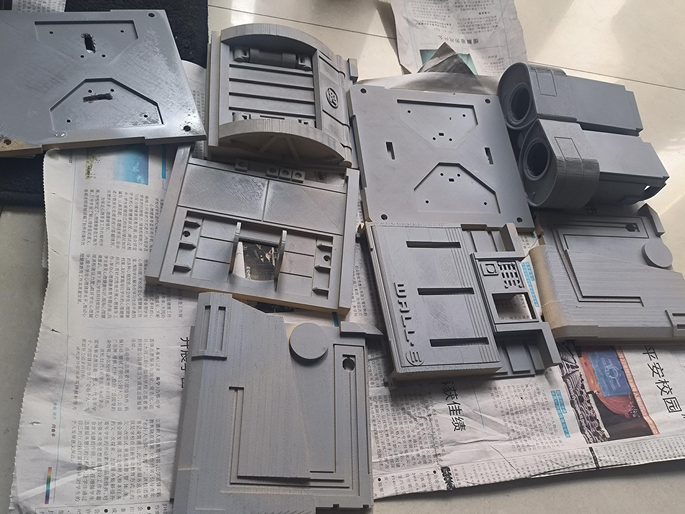
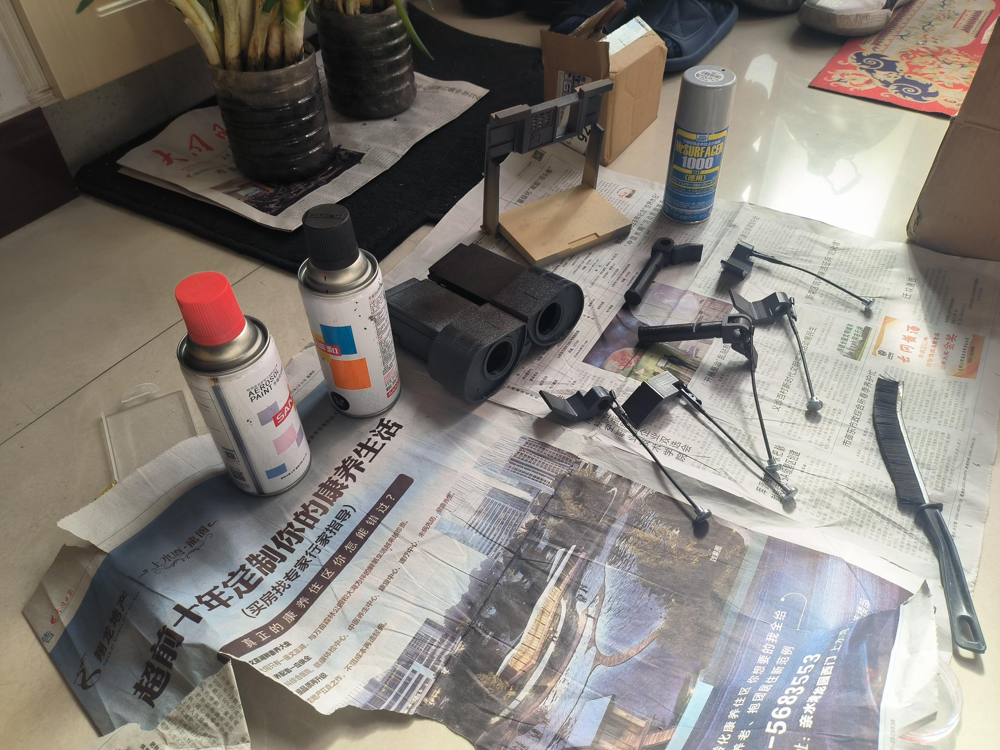

# 基于 ESP32-S3 的 WALL-E 移动机器人无线图传系统


本项目是我的毕业设计作品，旨在复刻经典机器人 WALL-E。系统以 **ESP32-S3** 为核心，实现了低延迟视觉图传、全双工运动控制及工业级抗干扰电源系统。 

---
## 🚀 项目亮点

- **全栈式开发**：从底层 PCB 硬件电路设计到上层 WebSocket 全双工通信协议的完整闭环。 
- **工业级电源设计**：自研 **12V 三路隔离电源分配模块**。通过物理隔离有效消除了电机/舵机启停产生的反向电动势对主控及传感器总线的干扰，提升系统稳定性。 
- **高性能流媒体**：基于 ESP-IDF 高并发任务调度，实现 320x240 @ 15FPS+ 的 MJPEG 视频推流，控制延迟控制在 200ms 以内。 
- **全双工遥测**：利用 WebSocket 协议传输 JSON 格式指令，支持电机控制指令下行及电池电压、RSSI 信号强度的实时回传。  

## 📂 目录结构

```text
WallE_Graduation/
├── 01-Spec/           # 技术规范与选型：包含硬件选型表、性能指标要求 
├── 02-Hardware/       # 硬件设计：原理图 (Schematic)、PCB Layout 及 BOM 清单 
├── 03-Software/       # 固件源码：基于 ESP-IDF 开发的视频流与运动控制程序 
├── 04-Mechanical/     # 机械结构：适配后的 3D 打印模型文件 (STL) 与组装指南 
├── 05-Assets/         # 项目资源：演示视频、电影原声、实物照片
├── 06-Thesis/         # 毕业论文：开题报告、论文正文及相关调研文档 
└── .gitignore         # Git 忽略文件配置   
```

## 📸 开发进程展示

### 1. 机械结构表面处理 (Painting-进行中)
为了还原 WALL-E 的真实质感，我对 3D 打印件进行了打磨与多层喷漆处理：

<p align="center">
  
  
</p>

## 📜 引用与致谢 (Credits)

本项目在开发过程中深度参考了以下开源项目及技术文档，特此致谢：

### 1. 机械结构与灵感来源
* **Chillibasket (walle-replica)**: 本项目的机械结构原型基于 Chillibasket 的开源设计 。
* **项目地址**: [https://github.com/chillibasket/walle-replica](https://github.com/chillibasket/walle-replica)

### 2. 技术参考文档
* **乐鑫科技 (Espressif Systems)**: 提供了完善的 $ESP32-S3$ 技术参考手册及 ESP-IDF 开发框架支持。


### 3. 原创贡献声明
相比于原版 Arduino/Python 的实现方案，本项目进行了以下核心改进：
* **系统底层重构**: 完全弃用模块化拼接，基于 **ESP-IDF** 实现了高性能的高并发任务调度。
* **抗干扰电源设计**: 针对感性负载（电机/舵机）设计了独立的 **12V 隔离电源分配板**，有效解决了频繁启停导致的系统复位问题 。
* **通信协议优化**: 采用 **WebSocket + JSON** 替代传统的 HTTP 轮询，大幅降低了控制延迟 。  

## ⚖️ 开源许可证 (License)

本项目基于开源项目 [Chillibasket/walle-replica](https://github.com/chillibasket/walle-replica) 进行二次开发。

根据 **GNU General Public License v3.0** 的要求：
- **整体授权**：本项目的所有源代码、电路设计及相关文档均采用 GPL v3 协议授权。
- **修改声明**：本项目由 gclv 于 2026 年进行了以下核心修改：
  - 将主控平台迁移至 ESP32-S3，并基于 ESP-IDF 开发了全套固件。
  - 设计了 12V 隔离电源分配板硬件电路及主控电路。
  - 优化了基于 WebSocket 的视觉图传与控制协议。
- **免责声明**：本程序在分发时希望它会有用，但不作任何保证 。

Copyright (C) 2026 gclv  
Copyright (C) 2023 Chillibasket (Original Mechanical Design)

