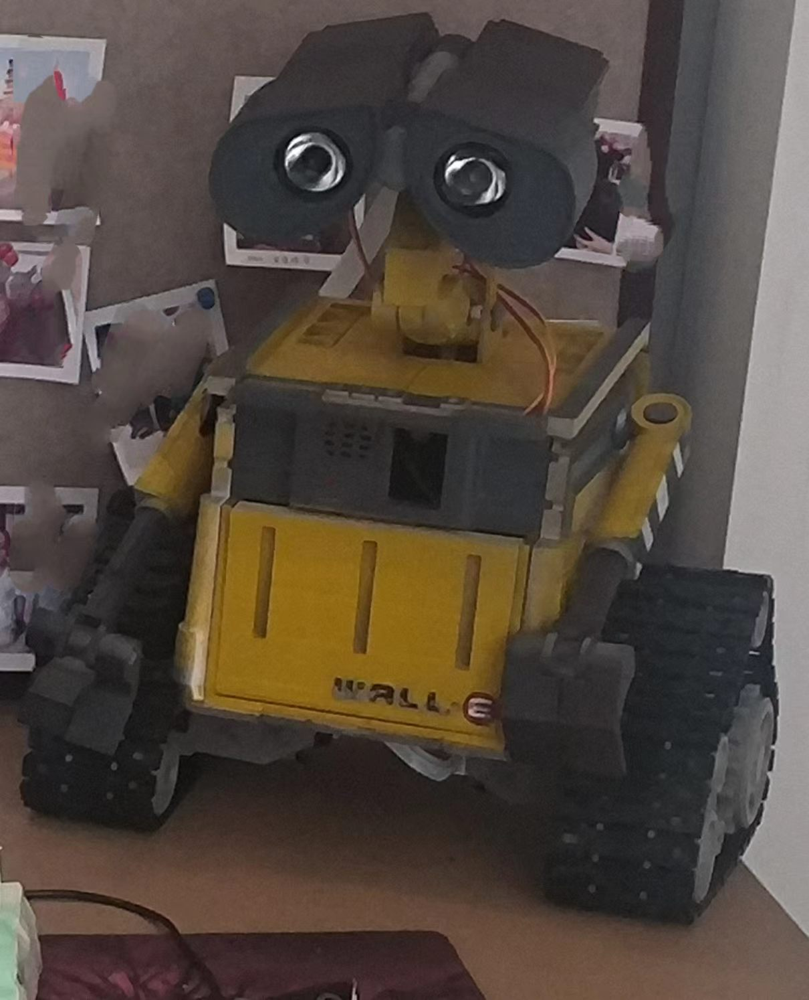
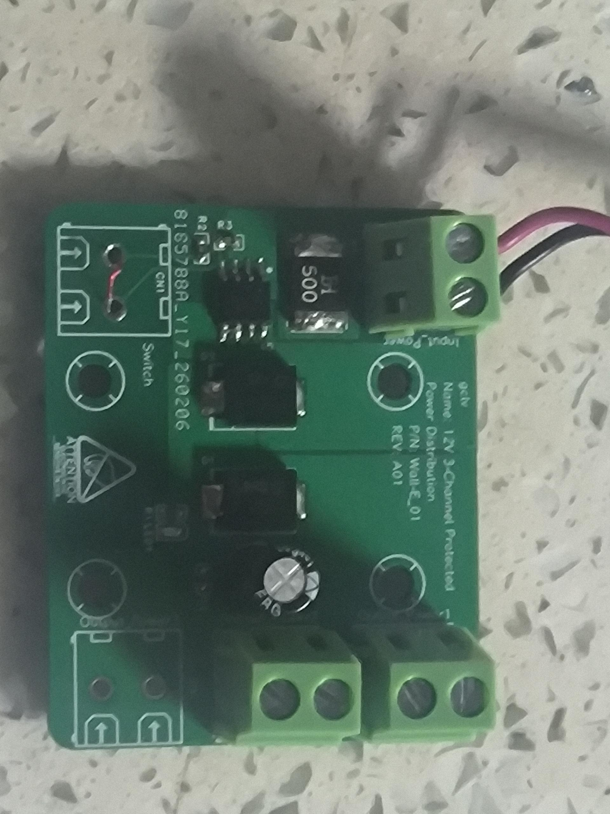
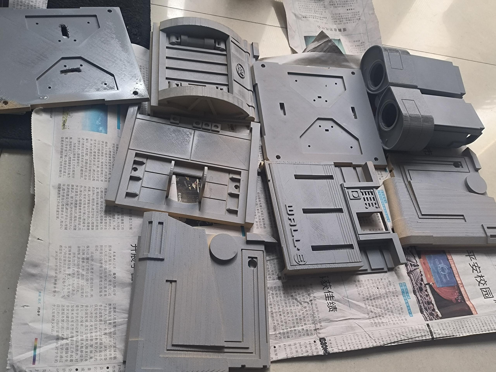
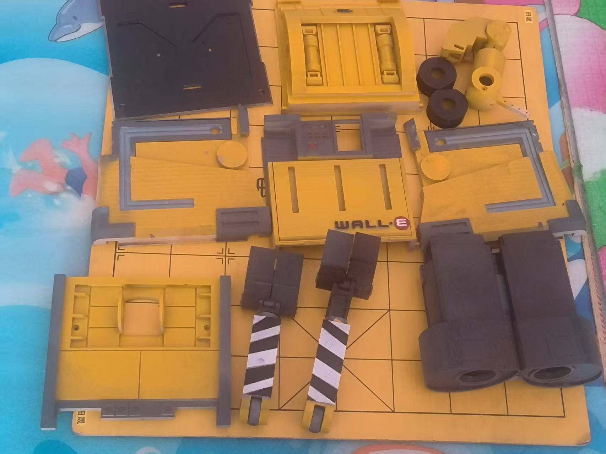
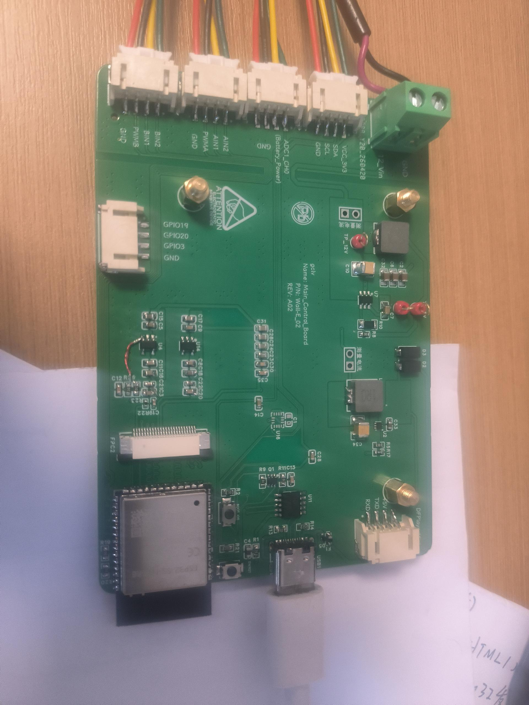
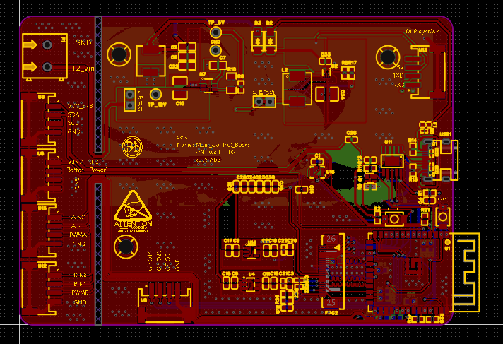

# 基于 ESP32-S3 的 WALL-E 移动机器人无线图传系统


> 复刻经典 · 全栈自研 · 从 PCB 到 WebSocket 的完整闭环

---

## 目录

- [项目背景](#项目背景)
- [实物展示](#实物展示)
- [系统架构总览](#系统架构总览)
- [主控电路设计思路演进](#主控电路设计思路演进)
- [固件架构](#固件架构)
- [功能演示](#功能演示)
- [当前进展与规划](#当前进展与规划)
- [项目文件结构](#项目文件结构)
- [引用与致谢](#引用与致谢)

---

## 项目背景

本项目是我的本科毕业设计，目标是以 **ESP32-S3** 为主控芯片，深度复刻皮克斯经典角色 **WALL-E**。

- 基于 **Chillibasket/walle-replica** 开源外壳设计，完成 3D 打印、打磨、组装与喷漆涂装
- 自研 12V 三路隔离电源分配板 + 主控 PCB
- 固件基于 ESP-IDF 原生框架，组件化架构
- 通信采用 WebSocket 全双工协议
- 支持 640x480 MJPEG 实时图传 + 全向运动控制 + 音频交互

> 从 **螺丝钉** 到 **WebSocket 数据帧**，全部亲手完成。

---

## 实物展示

### 整机外观

<p align="center">
  
</p>

### 内部布线 —— 电源分配板与主控板

<p align="center">
  
</p>

### 3D 打印表面处理

<p align="center">
  
  
</p>

---

## 系统架构总览

```
┌─────────────────────────────────────────────────────────────┐
│                   远程客户端 (浏览器/手机)                    │
│         WebSocket JSON 指令  ←→  MJPEG 视频流               │
└──────────────────────────┬──────────────────────────────────┘
                           │ WiFi
┌──────────────────────────▼──────────────────────────────────┐
│                     ESP32-S3 主控                            │
│  ┌──────────────────────────────────────────────────────┐   │
│  │  FreeRTOS 多任务调度                                   │   │
│  │                                                        │   │
│  │  WebSocket  ←→  servo_cmd_queue  ←→  servo_control  │   │
│  │      Handler            │                Task          │   │
│  │                         ├→ motor_cmd_queue ←→ motor   │   │
│  │                         │                   Task      │   │
│  │  HTTP Server ─→ stream_handle (MJPEG)                  │   │
│  │  CLI Console (串口调试命令)                             │   │
│  └──────────────────────────────────────────────────────┘   │
└──────────────────────────────────────────────────────────────┘
                           │
        ┌──────────────────┼──────────────────┐
        ▼                  ▼                  ▼
┌──────────────┐  ┌──────────────┐  ┌──────────────────┐
│  直流电机 x2  │  │ 舵机关节 x7   │  │ DFPlayerMini 音频 │
│  (TB6612驱动) │  │ (PCA9685驱动) │  │ (UART 串口)      │
│  LEDC 异步渐变│  │ 平滑插值动画   │  │ 音效播放         │
│  500ms心跳刹车 │  │ NVS参数持久化  │  │                  │
└──────────────┘  └──────────────┘  └──────────────────┘
```

---

## 主控电路设计思路演进

> 这是本项目的**核心难点**：如何处理电机/舵机感性负载对主控芯片的传导干扰。

### 阶段一：原始拓扑 —— "全局共地"与星形供电的陷阱

**【设计初衷】**

为了防止 MG513 电机和舵机的大电流烧毁主板，采用"强弱电分离"策略。引入外部 12V 三路电源分配板，实现星形供电。大电流走外部粗线，不经过主板。

```
          ┌──────────┐
   12V ──→│电源分配板  ├──→ 电机驱动板 (独立供电)
          │(三路隔离) ├──→ 舵机驱动板 (独立供电)
          │           ├──→ 主控板    (独立供电)
          └──────────┘
```

**【地弹反噬】**

虽然主供电在外部，但 ESP32 **必须**与驱动板连接一根信号 GND 线作为 0V 参考。电机的高频 PWM 产生极大的瞬态电流跳变（高 di/dt）。根据高频电流走电感最小路径的物理定律，部分回流电流"嫌弃"外部电源线，强行借道信号 GND 冲入主控板数字地平面，激发电压尖峰，导致 **MCU 死机 + I²C 挂死**。

---

### 阶段二：物理斩断 —— 电气隔离方案

**【思路】**

从物理层面彻底斩断连通。引入高速数字隔离器（ISO7741）和双向 I²C 隔离器（ADuM1250）。

隔离芯片内部通过电容/磁场耦合传递信号，两端地完全绝缘。电机的地弹被隔离墙挡在外面。

**【放弃原因】**

1. **成本与空间**：隔离芯片昂贵，配套外围消耗大量双层板空间
2. **隔离电源痛点**：需要独立副边电源（B0505S 模块），USB 调试时对侧无电会报错，极大增加联调难度

---

### 阶段三：划疆而治 —— PCB 分区与 0Ω 电阻单点桥接

**【思路】**

将板子划分为**洁净区（GND_MCU）** 和**污染区（GND_PWR）**，中间留出 1.5mm 无铜隔离带。单颗 0Ω 电阻连接两地。

**【致命缺陷】**

需要向外输出 8 根以上信号线（PWM + I²C），一颗 0805 电阻不可能让所有信号线紧贴它跨区。悬空跨过护城河的信号线，回流被迫绕大圈，形成巨大的**回流环路面积**，板子变成强烈的辐射天线。

```
       洁净区                污染区
    ┌──────────┐    ┌──────────────────┐
    │          │    │                  │
    │   MCU    │ ←──┼──→ 信号线悬空    │
    │          │    │     (下方无地)    │
    │  GND_MCU │ 护 │  GND_PWR         │
    │          │ 城 │                  │
    └────┬─────┘ 河 └────────┬─────────┘
         │                   │
         └── 0Ω ─────────────┘
          回流绕大圈 → 天线效应
```

---

### 阶段四：阻抗魔法 —— 窄铜桥接地

**【思路】**

废除 0Ω 电阻。在护城河中间保留一段 4~5mm 宽的**顶底双层纯铜皮**，作为两区唯一的物理连接点。

核心思路源于混合信号 PCB 接地设计中的 **单点连接（Single-Point Connection）** 与 **地平面分割（Split Ground Plane）** 原则：两区地平面仅通过一个物理点连接，且所有跨区信号必须紧贴该连接点走线以最小化回流环路面积。

**【为什么桥能挡住噪声？】**

利用窄覆铜的高频阻抗特性：

| 阵营 | 行为 | 结果 |
|------|------|------|
| **信号回流** | 所有跨区信号线**紧凑地从桥上方走过**，桥底有完整地铜皮，回流紧贴正下方返回 | 环路面积 ≈ 0，信号完整性极佳 |
| **电机噪声** | 高频噪声冲向主控区时发现只有窄桥可走，窄覆铜呈现**巨大寄生电感（扼流圈效应）** | 噪声被逼原路返回，老老实实走星形供电粗地线回电池 |

```
           信号线束 (全部紧贴桥面走)
           ↓↓↓↓↓↓↓↓↓↓↓↓↓↓↓↓↓↓↓↓
    ┌──────┐╔══════════════════╗┌──────────┐
    │      │║  4-5mm 铜桥     ║│          │
    │ MCU  │║  顶层+底层覆铜  ║│  电机驱动 │
    │洁净区│║  (低阻抗桥面)   ║│  污染区   │
    └──────┘╚══════════════════╝└──────────┘
                     ↑
             噪声到桥头 → 阻抗太大 → 折返
```

**参考文档：**
- Texas Instruments, *SPRAAS1B — Hardware Design Guidelines for TMS320F28xx and TMS320F28xx DSCs*

---

### 阶段五：同桥博弈 —— 12V 与信号线的串扰消除

**【问题】** 12V 正极线也必须走桥（否则回流被护城河挡住，再次形成大天线），但强电与弱电同桥会产生串扰。

**【工程解法】**

1. **3W 规则拉开间距**：12V 紧贴最左侧，弱电信号束紧贴最右侧，中间 ≥1mm 间距
2. **底层吸附**：桥的底层是完整地平面，电磁场就近耦合到底层地
3. **落地即滤波**：12V 刚跨过桥，**立刻紧贴放置 10μF/22μF 输入大电容**，DC-DC 开关纹波被截杀在桥头

```
┌─────────────────────────────────────┐
│ 12V ──→ [10μF] ──→ DC-DC 转换      │
│ 信号束 ──→ 直接进入 MCU 和外设       │
│       ↑ 桥头滤波，纹波就地吸收       │
└─────────────────────────────────────┘
```

---

### 阶段六：信号级修边 —— 源端阻抗匹配与逻辑加固

在底层架构确定后，对外围接口做最后加固：

| 措施 | 位置 | 作用 |
|------|------|------|
| 串联 **100Ω** | PWM/DIR 控制线 | 降低 di/dt，减小长排线过冲和反射 |
| 上拉 **2.2kΩ** | I²C 总线 | 增强抗干扰灌电流 |
| 串联 **22Ω** | SCL 时钟线 | 防时钟边沿毛刺 |
| 并联 **0.1μF** | PCA9685 3.3V 逻辑线 | 过滤空间噪声 |
| 串联 **22Ω** + 严禁打孔 | 摄像头 XCLK/PCLK/DVP | 确保图像数据零丢包 |

### 最终成果：主控 PCBA

<p align="center">
  
</p>

<p align="center">
  
</p>

---

## 固件架构

### 组件化分层设计

```
┌─────────────────────────────────────────┐
│  main.c (初始化 + 任务调度)              │
├─────────────────────────────────────────┤
│  Components/                            │
│  ├── Servo/      舵机子系统              │
│  │   ├── PCA9685.c      —— I2C 驱动层   │
│  │   ├── servo_app.c    —— 平滑动画任务  │
│  │   │                   (20ms tick)    │
│  │   └── Servo_app.h    —— API 对外      │
│  │       walle_servo_set_angle()         │
│  │       walle_joint_move()             │
│  │                                      │
│  ├── DC_Motor/   直流电机子系统           │
│  │   └── DC_Motor.c —— LEDC 异步渐变     │
│  │       DC_Motor_SetSpeedSmoothAsync()  │
│  │       500ms 心跳超时安全刹车           │
│  │                                      │
│  ├── wifi/       WiFi + WebSocket 服务   │
│  │   ├── wifi.c       —— STA 模式连接    │
│  │   ├── camera_app.c —— OV2640 驱动     │
│  │   ├── ws_handler   —— JSON 指令解析   │
│  │   └── stream_handle—— MJPEG 推流      │
│  │                                      │
│  ├── DFPlayerMini/ 音频子系统             │
│  │   └── DFPlayerMini.c —— UART 控制     │
│  │                                      │
│  ├── command/     CLI 控制台             │
│  │   ├── servo_cmd.c    —— 舵机调试      │
│  │   ├── DC_Motor_cmd.c —— 电机调试      │
│  │   ├── DFPlayerMini_cmd.c —— 音频调试   │
│  │   ├── nvs_cmd.c      —— NVS 读写      │
│  │   └── system.c       —— 系统诊断      │
│  │                                      │
│  └── display/    OLED 显示               │
└─────────────────────────────────────────┘
```

### 控制流：从手机到舵机的完整链路

```
手机 App                    ESP32-S3                       舵机
   │                          │                             │
   │  WebSocket JSON          │                             │
   │  {"S":[50,30,...],"D":100}│                             │
   ├─────────────────────────►│                             │
   │                          │                             │
   │                     ┌────▼────┐                        │
   │                     │ ws_     │                        │
   │                     │ handler │                        │
   │                     │解析JSON │                        │
   │                     └────┬────┘                        │
   │                          │ servo_cmd_t                 │
   │                     ┌────▼────┐                        │
   │                     │servo_cmd│                        │
   │                     │_queue   │                        │
   │                     │(覆盖写) │                        │
   │                     └────┬────┘                        │
   │                          │                             │
   │                     ┌────▼────────┐                    │
   │                     │servo_control│                    │
   │                     │_task        │  walle_joint_move()│
   │                     │7关节循环    ├──────────────────► │
   │                     └────┬────────┘                    │
   │                          │                             │
   │                     ┌────▼────┐                        │
   │                     │servo_   │ 每20ms更新角度          │
   │                     │fade_task│ ──────────────────────►│
   │                     │(平滑插值)│   PCA9685_set_angle() │
   │                     └─────────┘                        │
```

### 命名规范

整个代码库遵循统一的命名风格：

| 类别 | 规范 | 示例 |
|------|------|------|
| 宏定义 | 全大写 | `DC_MOTOR_LEFT_GPIO_1` |
| 组件 API | 前缀\_PascalVerb | `Servo_hw_Init()`, `DC_Motor_Stop()` |
| 应用层 API | `walle_` 前缀 | `walle_servo_set_angle()`, `walle_joint_move()` |
| 文件 | PascalCase / snake_case | `PCA9685.c`, `servo_app.c` |

---

## 功能演示

### 无线图传 (MJPEG Stream)

通过浏览器访问 `http://<ESP32-IP>:8081/stream` 获取 640x480 @ 15FPS 实时视频流：

```text
stream-demo.mp4
```

### 运动控制

```text
current_walle_activity_demo1.mp4  — 履带运动 + 关节动作
current_walle_activity_demo2.mp4  — 多关节协同运动
```

### CLI 控制台命令

| 命令 | 功能 |
|------|------|
| `servo <channel> <angle> <duration>` | 控制指定舵机到目标角度 |
| `servo_key <channel>` | 键盘交互式控制舵机 |
| `servo_calib <id> <min> <max> <rev>` | 校准关节限位和方向 |
| `motor_set <id> <speed> [duration]` | 设置电机速度 |
| `motor_stop [duration]` | 平滑停止电机 |
| `play_folder <folder> <file>` | 播放音频文件 |
| `hello` | 系统诊断报告 |
| `nvs_set / nvs_get` | NVS 读写 |

---

## 当前进展与规划

### 已实现 ✅

- [x] 主控 PCB 设计、打样与焊接验证
- [x] 12V 三路隔离电源分配板
- [x] 电机驱动（LEDC 异步渐变 + 心跳安全刹车）
- [x] 舵机控制（PCA9685 + 7 关节平滑动画 + NVS 参数持久化）
- [x] WiFi Station 模式 + WebSocket 服务器 (port 80)
- [x] OV2640 摄像头 MJPEG 推流 (port 8081)
- [x] DFPlayerMini 音频播放（UART 串口命令）
- [x] CLI 串口控制台（电机/舵机/音频/NVS 调试）
- [x] OLED 显示屏驱动（SSD1306，I2C 接口）

### 进行中 🔄

- [ ] **OLED 电量显示**：基于 ADC 采样电池电压，实时显示电量百分比
- [ ] **动作状态机**：上电后无控制指令时，随机执行电影经典动作并同步播放 DFPlayer 原声；当收到 WebSocket 控制指令时立即退出状态机，切换至手柄/远程控制模式
- [ ] **板载麦克风接口**：预留了麦克风硬件接口，后续可利用音频输入实现语音交互或声控触发

---

## 项目文件结构

```text
WallE_Graduation/
├── 01-Spec/                    # 技术规范、选型表、引脚分配
├── 02-Hardware/                # 硬件设计
│   └── Power_Distribution_Board/   # 电源分配板原理图 (PDF)
├── 03-Software/
│   └── Walle26/                # ESP-IDF 项目根目录
│       ├── main/               # app_main 主任务
│       ├── Components/
│       │   ├── Servo/          # 舵机控制 (PCA9685 + 平滑动画)
│       │   ├── DC_Motor/       # 直流电机 (LEDC 异步渐变)
│       │   ├── DFPlayerMini/   # 音频播放
│       │   ├── wifi/           # WiFi + WebSocket + 图传
│       │   ├── command/        # CLI 命令
│       │   └── display/        # OLED 电量显示
│       └── main/               # 启动入口
├── 04-Mechanical/              # 3D 打印模型 (STL)
├── 05-Assets/                  # 照片/视频/参考资料
├── 06-Thesis/                  # 毕业论文
└── README.md                   # 本文件
```

---

## 引用与致谢

### 机械结构原型

- **Chillibasket/walle-replica**: 本项目的机械结构基于此开源设计。
  https://github.com/chillibasket/walle-replica

### 技术参考

- **Espressif ESP-IDF**: 乐鑫官方物联网开发框架，提供 FreeRTOS、驱动库、协议栈等完整支持。
- **TI SPRAAS1B** — *Hardware Design Guidelines for TMS320F28xx and TMS320F28xx DSCs*

### 开源组件

- **nixy4/u8g2**: OLED 显示库
- **espressif/esp32-camera**: 摄像头驱动库
- **espressif/esp_jpeg**: JPEG 编解码库

### 原创贡献

1. **平台迁移**：从 Arduino 模块化拼凑升级为 ESP-IDF 原生多任务架构
2. **抗干扰电源设计**：自研隔离电源分配板 + 窄铜桥接地 PCB 布局，解决电机地弹问题
3. **通信协议优化**：HTTP 轮询 → WebSocket 全双工 JSON 协议，控制延迟降至 200ms 以内
4. **全方位功能集成**：图传、运动控制、音频播放、CLI 调试集成于单一 ESP32-S3 芯片

---

## 许可证

本项目基于 GPL v3 协议开源。

Copyright (C) 2026 gclv  
Copyright (C) 2023 Chillibasket (Original Mechanical Design)
